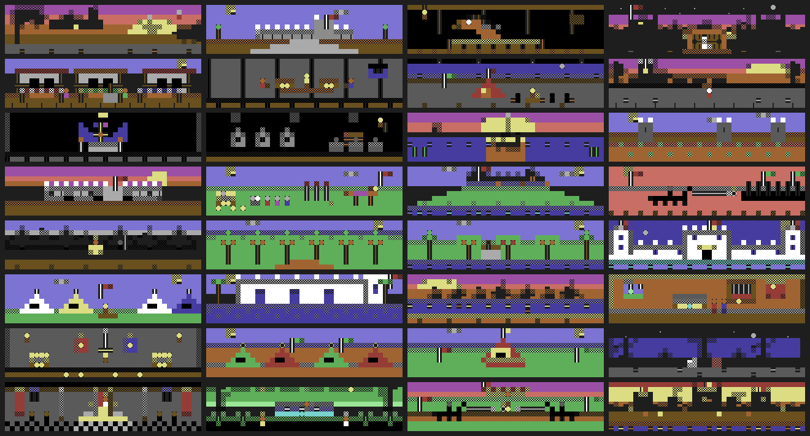
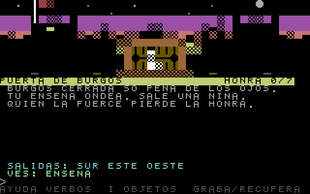
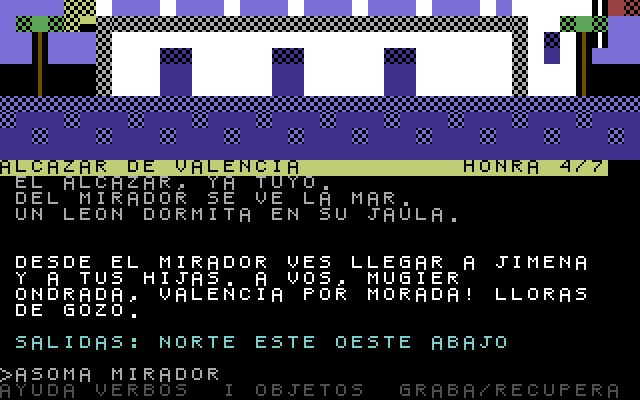
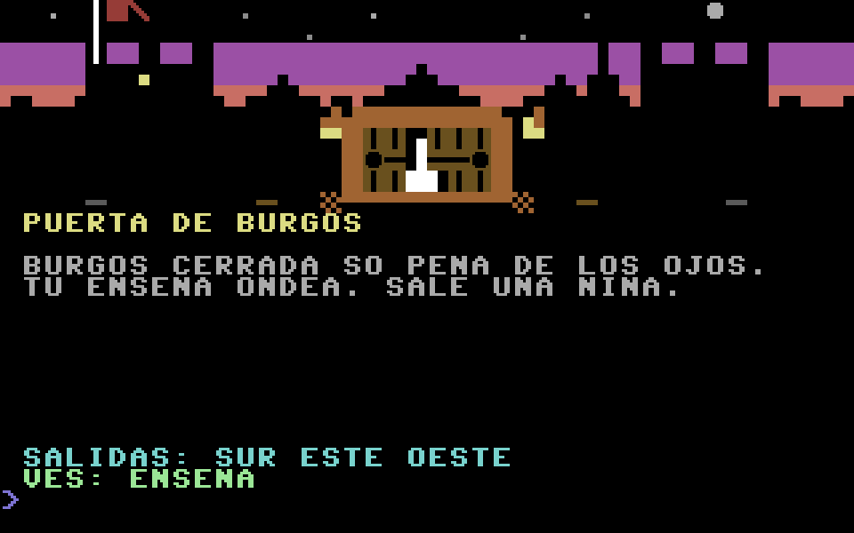
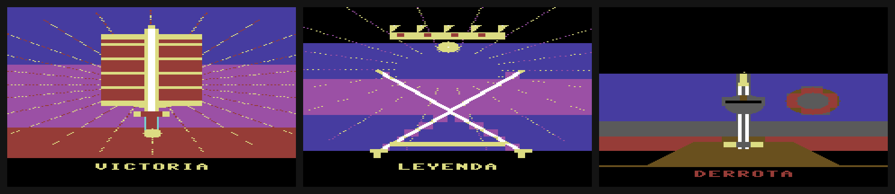

# EL CID CAMPEADOR — aventura conversacional para Commodore 64

A dense, illustrated **Spanish text adventure** (*aventura conversacional*) about
Rodrigo Díaz de Vivar, **El Cid**, faithful to the *Cantar de Mio Cid* — built for
a real **Commodore 64** in **BASIC v2.0**, in the spirit of the 1980s
*Aventuras AD* classics (*La Aventura Original*, *Cozumel*).

> *"De los sos ojos tan fuertemente llorando…"*



| | |
|---|---|
|  |  |

## What it is

* **32 rooms** spanning the whole epic: Vivar, the shut gates of Burgos, the
  *arcas de arena* with Raquel e Vidas, San Pedro de Cardeña, the crossing of the
  Duero, the frontier campaigns (Castejón, Alcocer, Fariz y Galve), Tévar and the
  sword **Colada**, the siege of **Valencia**, King Búcar and **Tizona**, the
  pardon and weddings, the *Afrenta de Corpes*, the **Cortes de Toledo**, the
  judicial duels, and the Cid's triumph.
* **A persistent screen.** The room description now lives on rows 11-14 and
  stays there while you play; the game's answer comes back below it on rows
  16-20. It used to overwrite the description with the first command you typed,
  and the only way to read it again was a full `MIRA` redraw.
* **A PETSCII pixel-art background for every room** — hand-drawn scenes with a
  **2×2 quarter-block mosaic layer** (all 16 PETSCII combos, 80×20 subpixels over
  the art area): round suns and crescent moons, rounded hills and clouds, true
  arched gates, lateen sails — drawn to screen + colour RAM (top 10 rows), with
  the text adventure below. Pennants flutter and water sparkles march.
* **A Spanish verb-noun parser** (`COGE ESPADA`, `MIRA NIÑA`, `VE NORTE`,
  `LLENA ARCAS`, `MONTA BABIECA`, `ECHA RELIQUIA`, `RETA INFANTES` …), ~30 items,
  NPCs, and **six ways to die — every one of them announced first**. Opening
  the *arcas* before they are sealed used to kill you on your first visit, and
  challenging the infantes before rescuing your daughters killed you after a
  silent failure; both now answer with the way out instead. A seventh death,
  charging at Fariz y Galve on foot, could never fire at all — room 16 is only
  reachable through the Duero gate, which already demands the horse — so its
  slot now carries the hint the room actually needed.
* **La honra del Cid — score & branching endings.** Seven optional *gestas* of
  honour — find la moneda visigoda by `CAVA`, the dream of the angel Gabriel, the
  Visigothic crown behind the altar-stand, give the relic's water, *feed the host*
  `DA VIANDA`, *show mercy* to the Moorish farmers on the road to Levante — and
  **tame the escaped lion of the alcázar** (`DOMA LEON`: the Cantar's most famous
  episode, playable at last, with the infantes hiding under the bench) — all
  count toward your honour. Win with all of them and the standard victory becomes
  a **legendary ending** that closes on the *Cantar*'s own coda — *"oy los reyes
  d'España sos parientes son."* Every secret now changes the ending; nothing is an
  inert trophy, and there is a real reason to play again.
* **Partidas guardadas**: `GRABA` writes the full game state to disk through the
  drive's error channel (so a missing disk answers in prose, not a crash);
  `RECUPERA` restores it and repaints.
* **SID sound, title music & living scenes.** Key clicks, footsteps on every
  room change, a death dirge (with a red border strobe), a victory fanfare —
  and the title screen now plays a **looping two-voice phrygian tune** (melody
  over a pulsing bass drone) while an **attract mode** rotates the scene behind
  the title through eight marquee paintings — every ~4 s, on the beat, driven
  from the same idle tick as the pennants and water sparkles (a tiny ML animator; the scene
  builders record their own animatable cells). The prompt cursor blinks.
* **La honra, on screen — and rewarded.** The room-name row is a reverse-video
  title bar that always shows **`honra n/7`** — a counter that only appeared
  once you had already found a secret taught nobody that the system existed —
  and the very moment a new deed lands, a
  rising SID arpeggio sounds, the border flashes gold, and the counter ticks up
  on the spot — immediate reward for the legend you're building.
* **No decoys.** Items earn their place: the war **saddle** is now required to ride
  Babieca, the **provisions** feed the mesnada for the siege — the things that look
  needed *are* needed.
* The famous lines of the *Cantar* are the reward for `MIRA`/`HABLA`, and the title
  opens on the most famous verse in Spanish epic: *"de los sos ojos tan
  fuertemientre llorando."*

## Running it

**C64** — take `elcid.d64`, then:

```
LOAD"ELCID",8
RUN
```

**C128 (native mode, 40 columns)** — take `elcid128.d64` (or just the file
`ELCID-128.PRG`, which is byte-identical to the disk's `elcid128` and fully
self-contained — the whole art set rides inside it):

```
DLOAD"ELCID"
RUN
```

That is the cover loader: it shows the Koala painting, waits for **FIRE** or a
key and then loads the game. `DLOAD"ELCID128"` goes straight to the game and
skips it. (The cover is on the disk for the first time in this revision — the
splitter that makes its three chunks, `build/build_blit.py`, was missing, so
`portada.kla` and `cidpic.bas` had been sitting in the repo unused.)

Run from the disk you get the ending story-cards and `GRABA`/`RECUPERA` saves;
run standalone the `TRAP`-guarded endings simply skip the cards. Either way the
game never strands you at `READY`: every ending waits for a key and **restarts
itself** for another run at the legend.

*(The old single-file C64 build with compact resident art was retired: the full
game — lion episode, saves, sound, animation, text caches — plus a resident art
table no longer fits in the C64's 38 KB of BASIC RAM. The disk build is strictly
better on every C64, including flash-cart users, who mount `.d64` images anyway.)*

To rebuild and re-prove everything in one command:

```sh
python3 build/verify.py          # 13 checks; --fast skips the disk rebuild
```

Two builds come from the **one** generator (game logic is identical; only the
art plumbing differs):

```sh
python3 build/build_bas.py --detail   # -> elcid-128.bas   RLE art inside the PRG  (C128)
python3 build/build_bas.py --c64disk  # -> elcid-c64d.bas  packed art bulk-LOADed  (C64 disk)
python3 build/mkdisk128.py            # -> ELCID-128.PRG + elcid128.d64 (game+art+cards)
python3 build/mkdisk64.py             # -> elcid.d64  (game + the 3 bulk art files)
```

The program forces a 40-column screen; text is printed through the **KERNAL
screen editor** (positioned with `HOME`+cursor moves, coloured by PETSCII
colour chars) because a BASIC `POKE` costs ~9 ms — the ROM path is ~50–90×
faster. Commands are read a key at a time. One hard-won rule the build now
enforces: **no tokenised BASIC line may exceed 255 bytes** — the C128 relinker
scans each line with an 8-bit index and hangs the machine forever on a longer
one (found empirically; the build asserts it on every disk build).

### Cover screen (C128)

`portada.kla` is a **Koala** multicolor bitmap cover (160×200). A bitmap needs
~10 KB of VIC RAM, so it can't share memory with the 30 KB game — instead the
boot menu runs a tiny loader (`cidpic.bas`) first. It shows the cover with the
C128's `GRAPHIC 3` mode (KERNAL-managed, so the 40-column IRQ doesn't revert the
VIC registers), waits for **FIRE** or a key, then `DLOAD`s the game. The build
([`build/build_blit.py`](build/build_blit.py)) splits the Koala into the three chunks the loader `BLOAD`s
(bitmap → `$2000`, GRAPHIC-3 colour screen → `$1C00`, colour-RAM image → a buffer
copied to `$D800`). The C64 build has no menu, so no splash there.

### Enhanced backgrounds (the disk builds)



*The gates of Burgos on a real C64 (`elcid.d64`), reached in-game from Vivar — the
background was `LOAD`ed from disk and blitted by the `$C000` machine-code routine.
This is a VICE capture with real ROMs, and it is the one picture here that is not a
render: it therefore shows the screen as it was **before** the current layout pass —
no name bar, no `honra` badge, no hint row. The art is what the blitter really put on
a C64's screen, which is what it is here to prove.*

The enhanced builds paint a far richer, hand-drawn PETSCII scene for every room,
and they keep **all 32 scenes resident in RAM**, so a room paint is one ~10 ms
machine-code blit and a room change **never touches the disk**:

* [`build/rooms.py`](build/rooms.py) authors all 32 scenes and packs them into a
  **19.2 KB blob** — 600 bytes per room: 400 screen codes + 200 colour bytes
  (two 4-bit cells per byte), with a pack/unpack self-proof at build time. It
  also hand-assembles the two ~100-byte 6502 blitters (poked from `DATA` at
  boot; both are NMI-safe — the RAM NMI vector points at an `RTI` for the
  moments the ROMs are banked out).
* **C128** (`--detail`): the art is **RLE-compressed to ~10 KB** (1.9×, with a
  build-time re-expansion proof) and rides **inside the game PRG itself** at
  `$A000` — bank-0 RAM above the program, safe because BASIC 7.0 keeps all
  variables in bank 1. One `SYS` banks to all-RAM+I/O (`$FF00=$3E`), looks the
  room up in an offset table and expands it straight to the screen and to
  `$D800`. That is why `ELCID-128.PRG` (45 KB) is self-contained.
* **C64** (`--c64disk`): the blob is bulk-`LOAD`ed **once at boot** as three
  files into RAM the BASIC interpreter cannot see — rooms 1-13 under the BASIC
  ROM (`$A000`), 14-26 under the KERNAL (`$E000`, KERNAL `LOAD` writes through
  the ROMs into RAM), 27-32 at `$C1E0`. The per-room blit banks all RAM in
  (`$01=$34`) to read the art and toggles I/O back per byte to write colour RAM.
  The game *gains* BASIC memory versus the lite build — 48 KB of art+program on
  a 38 KB-BASIC machine.

`elcid.d64` (game + `aa`/`ab`/`ac`) and `elcid128.d64` (game + the ending cards
below) are the ready-to-run disks. Every path was verified in VICE with real
ROMs: both machines render Burgos **byte-for-byte** (800/800 cells) against the
authored scenes, driven in-game from Vivar; the C64 disk also boots correctly
under true-drive emulation. (Those emulator runs predate the layout and art
pass in this revision and want re-running wherever real ROMs are available;
everything static — `build/verify.py` — is green.)

### Ending story cards (C128)



The three endings close on a full-screen **multicolour heraldic card** —
**VICTORIA** (Tizona upright over the Cid's banner), **LEYENDA** (the crown and
the crossed swords Tizona & Colada, shown at six of the seven honour *gestas* —
the same threshold the victory text uses, which the two used to disagree on)
and **DERROTA** (the sword thrust point-down into the burial mound, the
Cid's helm hung on the hilt). They are the same `GRAPHIC 3` multicolour bitmaps
the cover uses, so the C128's KERNAL-managed graphics mode paints them cleanly —
a per-room custom charset is impossible here because the 40-column IRQ keeps
reverting `$D018`, but `GRAPHIC 3` is IRQ-safe.

* [`build/cards.py`](build/cards.py) authors the three cards (self-contained, no
  chargen ROM — the label font is embedded) and emits each card's three chunks:
  bitmap → `$2000`, colour screen → `$1C00`, colour-RAM image → `$1300`.
* After the text ending (which still tallies your *honra*), the game `DLOAD`s a
  tiny loader (`cv`/`cl`/`cd`, clones of the cover's `cidpic`) that shows the
  card, waits for **FIRE** or a key, then reloads the game to play again.
* [`build/mkdisk128.py`](build/mkdisk128.py) rebuilds the whole `elcid128.d64`
  from source. The cards were verified in VICE both on their own and driven
  **end-to-end from a real in-game death**. The C64 build has no bitmap RAM to
  spare, so it keeps its text ending screens.

## The screen

```
 +--------------------------------------+
 |   (PETSCII scene: castle / sea /     |  rows 0-9   image
 |    huerta / oak grove / court …)     |
 |[PUERTA DE BURGOS         honra 2/7  ]|  row 10     name bar (reverse video)
 | burgos cerrada so pena de los ojos.  |  rows 11-14 description — it STAYS
 | tu ensena ondea. sale una nina.      |
 | quien la fuerce pierde la honra.     |
 |                                      |  row 15     rule
 | la nina de nueve annos te habla:     |  rows 16-20 the answer to your order
 | cid, el rey nos veda acogerte so     |
 | pena de los ojos. id, y dios os      |
 | valga. lloras y partes.              |
 | salidas: oeste este sur              |  row 21     exits
 | ves: ensena                          |  row 22     items here
 | > coge ensena_                       |  row 23     your command
 | ayuda=verbos  i=objetos  graba/rec.  |  row 24     hint bar
 +--------------------------------------+

One colour, one meaning: yellow is you (the name bar and the honour badge, and
the gold border flash when a *gesta* lands), light grey is the world, white is
the game answering you, cyan is where you can go, green is what you can take.
The same discipline went to the SID: gold border + rising arpeggio = honour,
white + fanfare = victory, red strobe + dirge = death, a fixed two-tap =
you moved, a short low buzz = no. Singing used to fire the victory fanfare.
```

There are **easter eggs** for the curious (a certain magic word from another
cave, singing, dancing, greeting, kissing your horse, plucking beards at the
Cortes, crossing yourself before the crow…). Type `AYUDA` for the verb list — it spells out every verb you actually need,
including the unusual ones (`CINE`, `ASOMA`, `FINGE`, `SOCORRE`, `SELLA`, `EMPENA`,
`RETA`…) — and `I` for your inventory. Victory, the **legendary** victory, and
defeat each get their own closing screen (the victory screen tallies your
*honra*). A full solution — and the seven honour *gestas* — is in
[`WALKTHROUGH.txt`](WALKTHROUGH.txt).

### Typing stays instant (no garbage-collection stalls)

The command line echoes each key by **POKEing it straight to screen RAM** and only
assembles `c$` (reading the row back) when you press **RETURN** — so typing
allocates **zero** strings. This matters most in **C64 mode**: BASIC v2.0's string
garbage collector is *O(n²)*, and with this game's ~300 resident strings a single
collection measures **~7.7 s** on a 1 MHz 64. The earlier input loop rebuilt the
whole line and re-scanned it with `MID$` on every key (~42 throwaway strings per
character), which triggered that collection every keystroke — the classic
"3–5 seconds per letter" stall. The current loop never feeds it. (C128 mode was
always fast: BASIC v7.0 has the fixed, quick collector.)

And when a collection *does* run, it is now fast too: the C64 GC's cost scales
with the number of strings **living on the heap** (each one is a full pass over
every string descriptor), so the exits cache — 32 concatenated strings, the
bulk of the live heap — was dropped in favour of rebuilding the exits line on
the fly (~1 jiffy per draw). Live heap strings fell from ~40 to ~8, cutting a
collection from ~1 s to ~0.2 s, below perception. The message area is also
cleared **incrementally** now (only the rows the previous message used, tracked
in `l9`, instead of all nine), saving ~10 % of a typical response.

### The response after a command is fast too (all-ROM redraw, bucketed parser)

Showing what happens after an order used to take **~9 s** on a 1 MHz machine. Two
things were slow, both measured in VICE:

* **The redraw.** The old text printer poked the screen one character at a time
  (`ASC(MID$(s$,j,1))` per cell), and clearing the 9-row message area was 360
  BASIC `POKE`s — and a BASIC `POKE` costs **~9 ms** here, so the clear alone was
  **3.4 s**. The printer now positions with `HOME`+cursor moves and hands the whole
  string to the **KERNAL screen editor** (`PRINT`), with colour set by a single
  PETSCII colour-control char instead of a per-cell colour `POKE`. The clear just
  prints blank lines. The editor is ~50–90× faster than a poke loop, so the clear
  dropped to **0.42 s** and a full redraw from **5.7 s → 1.7 s**. It is pure
  PETSCII, so it is identical on C64 and C128 (no `SYS`, no machine detection —
  the KERNAL `PLOT` call does *not* take its registers the same way on the 128,
  which is why cursor-control characters are used instead).
* **The parser.** `findverb`/`findnoun` scanned the whole 74-verb / 98-noun table
  with a string compare each (~15 ms apiece). The vocabulary is now emitted
  **sorted by first letter**, and at load the game builds a first-char index
  (`vs%`/`ns%`) so a lookup scans only the ~4 words sharing that initial — about
  **15× fewer** compares (worst case 2.6 s → 0.5–0.8 s).

### The deep pass: profiled with the jiffy clock, fixed at the roots

A later profiling pass (the game instrumented to stamp the jiffy clock at each
stage of a response, read back through the VICE monitor so the numbers are pure
machine time) found where the remaining seconds really lived, and none of it
was where it looked:

* **Text lookups re-READ the DATA.** Every room name/description/message lookup
  did `RESTORE` and skip-`READ` up to ~160 strings. Now every text is cached
  **once at boot** into `nn$`/`dd$`/`ms$` — on the C64 a string read from `DATA`
  costs only a 3-byte descriptor pointing into the program text itself.
* **Variable-table order.** CBM BASIC resolves every variable reference by
  scanning the table in *creation order* — and on the C128 that scan far-fetches
  from bank 1, which made it ~70 ms *per statement*. The hottest variables (echo
  loop, parser, printer) are now created **first** (line 4-5), and the `DIM`
  order puts the parser tables first. Parse time fell 140 → 39 jiffies.
* **Rule scan.** The 63-rule table is emitted **stable-sorted by room** with a
  first-rule index `rs%()`, so a command scans only the current room's handful
  of rules (`difftest2` proves the reorder changes no behaviour).
* **The wrapper.** The word-wrap scan walked the whole remaining text for every
  output row (one `MID$` alloc per char); it now exits at the first `/`.
* **2 MHz responses (C128).** The whole command response — parse, rules, redraw —
  runs under `FAST`; `SLOW` is restored at every input point. The VIC blanks for
  the fraction of a second of work and the screen pops back complete. Boot too.

Measured on the machines' own jiffy clocks (a move = full art + text redraw):

| build | move before | move after | gain |
|---|---|---|---|
| C128 (`ELCID-128.PRG`/`elcid128.d64`) | 889 jiffies (~15 s) | **119 (~2 s)** | **7.5×** |
| C64 disk (`elcid.d64`) | ~400 + a ~2 s disk load per room | **134 (~2.2 s), no disk** | **~4×** |

All of it is verified the same way everything else is: `difftest2.py` still
shows 0 behavioural mismatches vs. the reference simulator after every change.
(Those jiffy counts were measured on the machines' own clocks before the
current pass; the changes since — a rule table packed from 13 columns to 8, so
the common case is one array read where it was five, and a word-split that
stops at the first space instead of walking the whole order — only move in the
same direction, but they have not been re-measured on hardware.)

### What it costs, exactly

`memcheck.py` reports the C64 build's real budget, and this pass moved it a
long way: the string heap went from **336 bytes to 1 179**, against a modelled
worst case of 853. Three things paid for it, none of which changed a byte of
prose: `vs%`/`ns%` were dimensioned to 90 and indexed by raw PETSCII code, so
128 of their cells could never be reached; the 13-column rule table had five
columns that were zero for almost every rule (only 4 of 82 rules need a second
flag, one gives a second item) and they pack base-32 into three; and the exits
table held six six-bit room numbers in six 16-bit cells. The packing is also
*faster* — the interpreter's common case is now a single array read and a
single test.

## How it was built (and why it is correct)

This environment has no C64 ROMs, so the game could not be *run* during
development — every part is **statically verified** instead, from a single source
of truth in [`build/`](build):

1. **`cidspec.py`** — the whole world as data: rooms, items, a Spanish
   vocabulary, and a **data-driven rule table** (room + verb + object + required
   flags → effects), plus the puzzle gates and lose conditions.
2. **`cidsim.py`** — a Python reference engine that runs the *exact same logic*
   the C64 uses, and **auto-plays the 100-step critical path to prove the game is
   winnable** — gathering all seven honour *gestas* to prove the **legendary ending
   is reachable** — and checks every lose condition fires. (`*** VICTORY ***`.)
3. **`rooms.py` / `c64.py`** — the 32 PETSCII scenes, authored once and used to
   emit **both** the resident art blob **and** the PNG previews above, through the
   same C64-palette simulator. (`python3 build/rooms.py --montage out.png`
   reproduces `scenes-montage.png` byte for byte.) The montage used to be
   rendered from the compact art of the retired lite build, so the pictures were
   not the art the game paints; they come from the shipped blob now, and that
   build's art source has been removed along with it.
4. **`build_bas.py`** — assembles `elcid.bas`: the BASIC engine is a generic
   **rule-interpreter** that executes the very same rule table. The generated
   `DATA` was decoded back and checked **byte-for-byte against the spec**.
5. **`basemu.py` / `difftest2.py`** — an *independent* re-implementation of the
   **BASIC** engine reads the generated `DATA` straight back and diffs the result
   against `cidsim.py` across the whole critical path plus thousands of probe
   states: **zero behavioural divergences** — so the shipped BASIC provably matches
   the proven model, not merely the spec it was generated from.
6. The result tokenises with `petcat -w2` to a **byte-perfect round-trip**, and a
   static check (`cval.py`) confirms no C128-only keywords (`INSTR`/`ELSE`/`TRAP`/
   `GETKEY` are all avoided — BASIC v2.0 only), no dangling jumps, no 2-character
   variable collisions, and no writes to reserved variables (`TI`/`TI$`/`ST`).
7. **`memcheck.py`** — the C64 build lives at the edge of BASIC RAM, and there is
   no emulator here to discover an `?OUT OF MEMORY` the hard way, so the budget
   is computed instead: the tokenised program from `$0801`, every DIMmed array
   costed by the real CBM layout (a 5+2·ndims header, 2 bytes per integer cell,
   3 per string descriptor), every scalar at 7 bytes, and what is left for the
   string heap below `$A000`. It then **models the peak** that heap must survive
   — the four strings built at boot and never freed, what is live while a
   command runs, and three copies of the longest string the game builds by
   concatenation — and fails the build when the margin is gone.
8. **`deadcheck.py`** — content the player can never reach: a rule whose verb or
   noun the vocabulary pruner dropped, a rule shadowed by an earlier one in the
   same room, an item nothing ever grants, a flag tested but never set, an item
   whose own displayed name the parser does not accept, and a verb the `AYUDA`
   screen promises but the vocabulary never ships.
9. **`walkcheck.py`** — the shipped solution is prose, but the only path
   anything proves is `CRITPATH` in `cidsim.py`; this asserts
   [`WALKTHROUGH.txt`](WALKTHROUGH.txt) is that exact path, order and numbering
   included, so a change to the puzzle chain cannot leave the published
   walkthrough describing a game that no longer exists.
10. **`verify.py`** runs all of it in dependency order, and builds everything a
    second time to prove the output is deterministic.

So: *the logic is proven winnable, the generated data provably equals the proven
spec, the BASIC is provably legal v2.0, it provably fits in RAM, nothing in
the world is unreachable, and the published solution is the proven one.* The screenshots above come from the same simulator
that models the layout, so they verify it too (no overflow, no scroll).

What none of this can do is **run** the game — Debian and Ubuntu ship VICE
without the ROMs. [`build/fullcycle.py`](build/fullcycle.py) plays the whole
critical path on a real emulated C64 and remains the last word wherever ROMs
exist. One class of bug stays invisible to every static check here: a new line
number landing inside an existing fall-through chain, because `basemu.py`
re-implements the BASIC's *semantics*, not its line order.

*(c) 2026 Tombatossals Softworks — "Estas son las nuevas de mio Cid el Campeador."*
